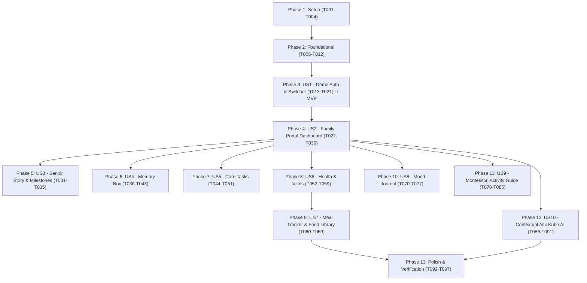

# Tasks: Kubo North Family Care App Rebuild

**Input**: Design documents from `/specs/003-rebuild-kubo-app/`  
**Prerequisites**: [plan.md](./plan.md) (required), [spec.md](./spec.md) (required), [research.md](./research.md), [data-model.md](./data-model.md), [contracts/](./contracts/), [quickstart.md](./quickstart.md)

**Tests**: Tests are explicitly requested for both iOS and Android (unit, widget, and platform-specific test suites).  
**Organization**: Tasks are grouped by user story to enable independent implementation and testing of each story.

## Format: `- [ ] [TaskID] [P?] [Story?] Description with file path`

- **[P]**: Can run in parallel (different files, no dependencies)
- **[Story]**: Which user story this task belongs to (e.g., [US1], [US2], [US3]...)
- All descriptions reference exact file paths

---

## Phase 1: Setup (Shared Infrastructure)

**Purpose**: Project initialization, environment configuration, and root developer toolchain

- [X] T001 Verify and update Flutter dependencies in `pubspec.yaml`
- [X] T002 [P] Verify root developer workflow targets in `Makefile` (run, run-prod, test, test-ios, test-android, analyze, clean)
- [X] T003 [P] Implement centralized configuration reader in `lib/core/config/app_config.dart` (`API_BASE_URL`, `USE_MOCK_DATA`, `AUTH_SERVICE_URL`, `CARE_SERVICE_URL`, `AI_SERVICE_URL`, `ENVIRONMENT`)
- [X] T004 [P] Implement unit tests for environment configuration in `test/unit/config_test.dart`

---

## Phase 2: Foundational (Blocking Prerequisites)

**Purpose**: Core design tokens, theme, routing, and abstract repository infrastructure with microservice integration hooks

**⚠️ CRITICAL**: No user story work can begin until this phase is complete

- [X] T005 Implement Figma design color tokens (`#F2FAF5` base background, calming greens, warm neutrals) in `lib/core/theme/app_colors.dart`
- [X] T006 [P] Implement typography and accessible touch target theme (min 48x48dp, Noto Serif, Plus Jakarta Sans) in `lib/core/theme/app_theme.dart`
- [X] T007 [P] Implement HTTP client wrapper with microservice header and logging support in `lib/core/network/api_client.dart`
- [X] T008 [P] Implement application routing navigation shell for the 6 core tabs and demo auth flow in `lib/core/router/app_router.dart`
- [X] T009 [P] Create initial resident and circle mock data fixtures (Margaret Thompson, Robert Chen, Dorothy Williams) in `lib/data/fixtures/resident_fixtures.dart`
- [X] T010 Create shared resident header widget with active circle info and "Switch" trigger in `lib/presentation/shared/resident_header.dart`
- [X] T011 [P] Create shared bottom navigation bar widget for the 6 primary tabs in `lib/presentation/shared/app_bottom_nav.dart`
- [X] T012 Implement platform test harness for iOS Cupertino and Android Material validation in `test/platform/platform_harness.dart`

**Checkpoint**: Foundation ready — user story implementation can now begin in dependency order.

---

## Phase 3: User Story 1 - Family Member Authentication & Demo Profile Switching (Priority: P1) 🎯 MVP

**Goal**: Deliver the default Demo Profile Selector (Margaret, Robert, Dorothy) and credentials login with resident profile switching.

**Independent Test**: Launch application, verify demo profile cards appear by default, switch between Margaret, Robert, and Dorothy, and confirm user authentication state updates in Riverpod.

### Tests for User Story 1
- [X] T013 [P] [US1] Unit test for authentication state and demo profile switching in `test/unit/auth_provider_test.dart`
- [X] T014 [P] [US1] Platform widget test for iOS demo profile selector and transition in `test/platform/ios_demo_login_test.dart`
- [X] T015 [P] [US1] Platform widget test for Android demo profile selector and back-navigation in `test/platform/android_demo_login_test.dart`

### Implementation for User Story 1
- [X] T016 [P] [US1] Implement `UserProfile` entity and user role enum in `lib/domain/entities/user_profile.dart`
- [X] T017 [US1] Implement `AuthRepository` interface with `// [MICROSERVICE_INTEGRATION_POINT]: AuthService - Login/Profile Switch` in `lib/data/repositories/auth_repository.dart`
- [X] T018 [US1] Implement `MockAuthRepository` with local persistence and demo users in `lib/data/repositories/mock_auth_repository.dart`
- [X] T019 [US1] Implement Riverpod `authProvider` managing active user profile in `lib/presentation/auth/auth_provider.dart`
- [X] T020 [US1] Build Demo Profile Selector screen matching Figma canvas `demo login profiles` in `lib/presentation/auth/demo_login_screen.dart`
- [X] T021 [US1] Build standard username/password credentials login screen matching Figma canvas `Main login` in `lib/presentation/auth/login_screen.dart`

**Checkpoint**: User Story 1 is functional as a standalone MVP slice.

---

## Phase 4: User Story 2 - Family Portal Dashboard & Daily Snapshot (Priority: P1)

**Goal**: Present the central Family Portal home dashboard consolidating daily wellbeing, recent mood card, "Their story" preview, and Montessori guide banner.

**Independent Test**: Navigate to Family Portal tab, verify Margaret Thompson's daily status card, mood status badge, and navigation hooks to full story and memory box.

### Tests for User Story 2
- [X] T022 [P] [US2] Widget test for Family Portal layout and status cards in `test/widget/family_portal_test.dart`
- [X] T023 [P] [US2] Platform test for iOS Cupertino scroll behavior and cards in `test/platform/ios_family_portal_test.dart`
- [X] T024 [P] [US2] Platform test for Android Material ripple and status cards in `test/platform/android_family_portal_test.dart`

### Implementation for User Story 2
- [X] T025 [P] [US2] Implement `Resident` domain entity and `Milestone` model in `lib/domain/entities/resident.dart`
- [X] T026 [US2] Implement `ResidentRepository` interface with `// [MICROSERVICE_INTEGRATION_POINT]: ResidentService - Get Profile` in `lib/data/repositories/resident_repository.dart`
- [X] T027 [US2] Implement `MockResidentRepository` pre-populated with Margaret, Robert, and Dorothy in `lib/data/repositories/mock_resident_repository.dart`
- [X] T028 [US2] Implement Riverpod `residentProvider` managing active resident and circle state in `lib/presentation/family_portal/resident_provider.dart`
- [X] T029 [US2] Build Family Portal Home screen matching Figma `Family Portal -> Home` in `lib/presentation/family_portal/family_portal_screen.dart`
- [X] T030 [US2] Build active wellbeing alert banner component for critical health/nutrition drops in `lib/presentation/family_portal/widgets/wellbeing_alert_banner.dart`

**Checkpoint**: Family Portal renders resident daily snapshot and wellbeing alerts.

---

## Phase 5: User Story 3 - Senior Story & Biographical Milestones (Priority: P1)

**Goal**: Dedicated biographical narrative view displaying personal life portraits, educator career history, life milestones (1965 to 2018), and quote.

**Independent Test**: Tap "Their story" from Family Portal, verify biographical overview, milestone timeline sequence, and "Add a Memory" trigger.

### Tests for User Story 3
- [X] T031 [P] [US3] Widget test for milestone timeline and biography in `test/widget/their_story_test.dart`
- [X] T032 [P] [US3] Platform test for iOS sheet presentation of Senior Story in `test/platform/ios_story_modal_test.dart`

### Implementation for User Story 3
- [X] T033 [P] [US3] Implement life story biography widget with philosophy quote in `lib/presentation/their_story/widgets/life_portrait_card.dart`
- [X] T034 [P] [US3] Implement milestone timeline widget (1965 wedding, 1998 award, 2000 retirement, 2018 loss) in `lib/presentation/their_story/widgets/milestone_timeline.dart`
- [X] T035 [US3] Build full "Their Story" screen matching Figma `Their story interaction` in `lib/presentation/their_story/their_story_screen.dart`

**Checkpoint**: Senior Story displays full life milestones and reflections.

---

## Phase 6: User Story 4 - Memory Box & Multi-Format Reminiscence (Priority: P2)

**Goal**: Reminiscence gallery supporting Photo, Story, Letter, and Video memories with dual file picker/URL input and tagging.

**Independent Test**: Open Memory Box tab, filter existing memories, tap "Add to Memory Box", select format, fill title/tags/media, and save to verify immediate feed update.

### Tests for User Story 4
- [X] T036 [P] [US4] Unit test for memory repository CRUD and tag filtering in `test/unit/memory_repository_test.dart`
- [X] T037 [P] [US4] Widget test for Memory Box feed and creation modal in `test/widget/memory_box_test.dart`

### Implementation for User Story 4
- [X] T038 [P] [US4] Implement `MemoryItem` domain entity and `MemoryFormat` enum in `lib/domain/entities/memory_item.dart`
- [X] T039 [US4] Implement `MemoryRepository` interface with `// [MICROSERVICE_INTEGRATION_POINT]: MemoryService - List/Create Memories` in `lib/data/repositories/memory_repository.dart`
- [X] T040 [US4] Implement `MockMemoryRepository` with pre-loaded family memories in `lib/data/repositories/mock_memory_repository.dart`
- [X] T041 [US4] Implement Riverpod `memoryBoxProvider` in `lib/presentation/memory_box/memory_box_provider.dart`
- [X] T042 [US4] Build Memory Box Home gallery matching Figma `Memory Box Tab -> Memory Box Home` in `lib/presentation/memory_box/memory_box_screen.dart`
- [X] T043 [US4] Build "Add to Memory Box" creation modal with dual local file compression & URL input matching Figma `Add to Memory Box Interaction` in `lib/presentation/memory_box/widgets/add_memory_sheet.dart`

**Checkpoint**: Memory Box allows browsing, filtering, and adding memories with dual media input.

---

## Phase 7: User Story 5 - Daily Care Tasks & Routine Coordination (Priority: P2)

**Goal**: Daily schedule of purposeful activities with start/complete/skip actions, caregiver sign-off simulation (e.g. Nurse Jane), and activity creation modal.

**Independent Test**: Open Care Tasks tab, verify progress counter (e.g. "1/3 completed today"), tap "Complete" on a task, and use "Add Task" to schedule a new activity.

### Tests for User Story 5
- [X] T044 [P] [US5] Unit test for task status transitions and progress counter in `test/unit/care_tasks_test.dart`
- [X] T045 [P] [US5] Widget test for Care Tasks list and "Schedule New Activity" sheet in `test/widget/care_tasks_test.dart`

### Implementation for User Story 5
- [X] T046 [P] [US5] Implement `CareTask` domain entity, `TaskCategory`, and `TaskStatus` in `lib/domain/entities/care_task.dart`
- [X] T047 [US5] Implement `CareTasksRepository` interface with `// [MICROSERVICE_INTEGRATION_POINT]: CareService - Tasks API` in `lib/data/repositories/care_tasks_repository.dart`
- [X] T048 [US5] Implement `MockCareTasksRepository` pre-populated with Morning Garden Walk, Laundry Folding, and Music Reminiscence in `lib/data/repositories/mock_care_tasks_repository.dart`
- [X] T049 [US5] Implement Riverpod `careTasksProvider` in `lib/presentation/care_tasks/care_tasks_provider.dart`
- [X] T050 [US5] Build Care Tasks Home view matching Figma `Care Tasks Tab -> Care Tasks Home` in `lib/presentation/care_tasks/care_tasks_screen.dart`
- [X] T051 [US5] Build "Schedule New Activity" modal sheet matching Figma `Add Tasks Interaction` in `lib/presentation/care_tasks/widgets/add_task_sheet.dart`

**Checkpoint**: Care tasks track daily routines and record sign-off attributions.

---

## Phase 8: User Story 6 - Health, Vitals & Clinical Observation Tracking (Priority: P2)

**Goal**: Structured physiological vitals recording (BP, HR, Temp, Weight, Mobility, Pain 0-10, Clinical notes) and medical condition badges.

**Independent Test**: Navigate to Health & Vitals, verify conditions (Mild Dementia, Arthritis, Hypertension) and allergy warnings (⚠ Penicillin), and record a new vital sign entry.

### Tests for User Story 6
- [X] T052 [P] [US6] Unit test for vitals validation and pain level bounds in `test/unit/vitals_validation_test.dart`
- [X] T053 [P] [US6] Widget test for Health & Vitals screen and vitals entry form in `test/widget/health_vitals_test.dart`

### Implementation for User Story 6
- [X] T054 [P] [US6] Implement `VitalSign` domain entity in `lib/domain/entities/vital_sign.dart`
- [X] T055 [US6] Implement `HealthVitalsRepository` interface with `// [MICROSERVICE_INTEGRATION_POINT]: HealthService - Vitals API` in `lib/data/repositories/health_vitals_repository.dart`
- [X] T056 [US6] Implement `MockHealthVitalsRepository` in `lib/data/repositories/mock_health_vitals_repository.dart`
- [X] T057 [US6] Implement Riverpod `healthVitalsProvider` in `lib/presentation/health_vitals/health_vitals_provider.dart`
- [X] T058 [US6] Build "Record Health Vitals" form widget in `lib/presentation/health_vitals/widgets/record_vitals_form.dart`
- [X] T059 [US6] Build Health & Vitals screen matching Figma `Health and Vitals Homepage` in `lib/presentation/health_vitals/health_vitals_screen.dart`

**Checkpoint**: Health & Vitals allows recording and viewing physiological signs and medical conditions.

---

## Phase 9: User Story 7 - Meal Tracker & Curated Food Nutrition Library (Priority: P2)

**Goal**: Meal tracking across Breakfast, Lunch, Dinner, Snack with a 35+ item searchable Food Library, custom foods, intake percentage calculations, and daily target progress.

**Independent Test**: Open Meal Tracker, select Breakfast, search "Oatmeal" in Food Library, select portion, adjust actual intake to 75%, and verify consumed calories/macros recalculate.

### Tests for User Story 7
- [X] T060 [P] [US7] Unit test for food nutrient calculations and actual intake scaling in `test/unit/nutrient_calculation_test.dart`
- [X] T061 [P] [US7] Widget test for Food Library search and Custom Food sheet in `test/widget/meal_tracker_test.dart`

### Implementation for User Story 7
- [X] T062 [P] [US7] Implement `FoodItem` and `MealLog` domain entities in `lib/domain/entities/meal_log.dart`
- [X] T063 [P] [US7] Populate 35+ food library items fixture in `lib/data/fixtures/food_fixtures.dart`
- [X] T064 [US7] Implement `MealRepository` interface with `// [MICROSERVICE_INTEGRATION_POINT]: NutritionService - Meal API` in `lib/data/repositories/meal_repository.dart`
- [X] T065 [US7] Implement `MockMealRepository` with today's logged meals in `lib/data/repositories/mock_meal_repository.dart`
- [X] T066 [US7] Implement Riverpod `mealTrackerProvider` in `lib/presentation/health_vitals/meal_tracker_provider.dart`
- [X] T067 [US7] Build searchable Food Library modal matching Figma `Food Library Interaction` in `lib/presentation/health_vitals/widgets/food_library_sheet.dart`
- [X] T068 [US7] Build Custom Food entry modal matching Figma `Custom Food Interaction` in `lib/presentation/health_vitals/widgets/custom_food_sheet.dart`
- [X] T069 [US7] Build Today's Nutrition macro progress bars and meal history cards in `lib/presentation/health_vitals/widgets/meal_tracker_widget.dart`

**Checkpoint**: Meal Tracker accurately calculates net nutrition across 35+ library foods and custom items.

---

## Phase 10: User Story 8 - Daily Mood Journal & Emotional Trend Logging (Priority: P2)

**Goal**: Daily mood assessments, empty states, logging emotional states with context notes, and weekly timeline trends.

**Independent Test**: Open Mood Journal tab, verify "No mood entries yet" state, tap "Log Current Mood", choose an emotion, and view the updated mood history.

### Tests for User Story 8
- [X] T070 [P] [US8] Unit test for mood journal repository in `test/unit/mood_journal_test.dart`
- [X] T071 [P] [US8] Widget test for Mood Journal screen and logging form in `test/widget/mood_journal_test.dart`

### Implementation for User Story 8
- [X] T072 [P] [US8] Implement `MoodEntry` domain entity in `lib/domain/entities/mood_entry.dart`
- [X] T073 [US8] Implement `MoodRepository` interface with `// [MICROSERVICE_INTEGRATION_POINT]: MoodService - History API` in `lib/data/repositories/mood_repository.dart`
- [X] T074 [US8] Implement `MockMoodRepository` with initial empty/populated states in `lib/data/repositories/mock_mood_repository.dart`
- [X] T075 [US8] Implement Riverpod `moodJournalProvider` in `lib/presentation/mood_journal/mood_journal_provider.dart`
- [X] T076 [US8] Build Mood Journal screen matching Figma `Mood Journal Tab -> Mood Journal Home` in `lib/presentation/mood_journal/mood_journal_screen.dart`
- [X] T077 [US8] Build "Log Current Mood" dialog sheet in `lib/presentation/mood_journal/widgets/log_mood_sheet.dart`

**Checkpoint**: Mood Journal records and displays daily emotional reflections.

---

## Phase 11: User Story 9 - Montessori Activity Guide & Engagement Facilitation (Priority: P3)

**Goal**: Curated Montessori engagement activities with category counts (Practical Life, Cognitive, Creative, Sensory, Social), why-it-matters explanations, and facilitation steps.

**Independent Test**: Open Activity Guide tab, filter by category pills, expand an activity card (e.g. "Seed Sorting & Planting Tray"), and review step-by-step facilitation instructions.

### Tests for User Story 9
- [X] T078 [P] [US9] Widget test for Montessori Activity Guide and category filters in `test/widget/activity_guide_test.dart`

### Implementation for User Story 9
- [X] T079 [P] [US9] Implement `MontessoriActivity` domain entity in `lib/domain/entities/montessori_activity.dart`
- [X] T080 [P] [US9] Populate Montessori activities fixture in `lib/data/fixtures/montessori_fixtures.dart`
- [X] T081 [US9] Implement `ActivityGuideRepository` interface with `// [MICROSERVICE_INTEGRATION_POINT]: ActivityService - Guide API` in `lib/data/repositories/activity_guide_repository.dart`
- [X] T082 [US9] Implement `MockActivityGuideRepository` in `lib/data/repositories/mock_activity_guide_repository.dart`
- [X] T083 [US9] Implement Riverpod `activityGuideProvider` in `lib/presentation/activity_guide/activity_guide_provider.dart`
- [X] T084 [US9] Build Montessori Activity Guide screen matching Figma `Activity Guide Tab -> KUBO APP FAMILY ONLY` in `lib/presentation/activity_guide/activity_guide_screen.dart`
- [X] T085 [US9] Build expandable activity card widget with "Why this matters" and "How to do this activity" in `lib/presentation/activity_guide/widgets/activity_card.dart`

**Checkpoint**: Activity Guide delivers curated, dignity-centered Montessori engagement ideas.

---

## Phase 12: User Story 10 - Contextual "Ask Kubo AI" Family Assistant (Priority: P3)

**Goal**: Responsive contextual drawer accessible from all tabs with quick prompt chips, streaming live LLM responses (when `VITE_GEMINI_API_KEY` configured), and instant fallback to offline Montessori guidance cards.

**Independent Test**: Tap floating "Ask Kubo North AI" from Family Portal or Care Tasks, select a prompt chip (e.g. "What should I bring on visits?"), and verify contextual supportive answer appears.

### Tests for User Story 10
- [X] T086 [P] [US10] Unit test for AI assistant fallback logic in `test/unit/ai_assistant_test.dart`
- [X] T087 [P] [US10] Widget test for AI assistant drawer across tabs in `test/widget/ai_drawer_test.dart`

### Implementation for User Story 10
- [X] T088 [P] [US10] Implement `AiAssistantRepository` interface with `// [MICROSERVICE_INTEGRATION_POINT]: AiService - Streaming/Query API` in `lib/data/repositories/ai_assistant_repository.dart`
- [X] T089 [US10] Implement `MockAiAssistantRepository` with curated Montessori responses and optional live Gemini streaming in `lib/data/repositories/mock_ai_assistant_repository.dart`
- [X] T090 [US10] Implement Riverpod `aiAssistantProvider` in `lib/presentation/ai_assistant/ai_assistant_provider.dart`
- [X] T091 [US10] Build contextual "Ask Kubo AI" drawer matching Figma AI screens across tabs in `lib/presentation/ai_assistant/ai_assistant_drawer.dart`

**Checkpoint**: Contextual AI assistant provides instant elder-care guidance on every screen.

---

## Phase 13: Polish & Cross-Cutting Concerns

**Purpose**: Multi-resident local storage isolation, "Reset to Demo" support, accessibility audits, and full test suite verification

- [X] T092 Implement multi-resident profile persistence and "Reset to Demo" action in `lib/data/local/profile_storage_manager.dart`
- [X] T093 [P] Add profile reset action button to resident switcher drawer in `lib/presentation/shared/resident_switch_modal.dart`
- [X] T094 [P] Run accessibility audit verifying all interactive elements maintain >= 48x48 point touch targets and WCAG 2.1 AA contrast
- [X] T095 Execute full automated test suite on iOS via `make test-ios`
- [X] T096 Execute full automated test suite on Android via `make test-android`
- [X] T097 Run static analysis and lint checks via `make analyze`

---

## Dependencies & Execution Order

### Parallel Opportunities Identified

- **Setup & Foundational**: T002 (Makefile), T003 (AppConfig), T005 (Colors), T006 (Theme), T007 (ApiClient), T008 (Router), T009 (Fixtures) can all be authored in parallel.
- **User Stories (Phase 6 through 11)**: Memory Box (US4), Care Tasks (US5), Health & Vitals (US6), Mood Journal (US8), Activity Guide (US9), and AI Assistant (US10) depend on the Foundational shell and US1/US2, but can be built in parallel.
- **Dual Platform Tests**: iOS tests (`test/platform/ios_*`) and Android tests (`test/platform/android_*`) can be authored and executed independently.

---

## Implementation Strategy & MVP Scope

1. **MVP Milestone (Phases 1, 2, 3)**:
   - Delivers runnable Flutter app with Makefile, `AppConfig`, Design Tokens, Theme, and User Story 1 (Demo Profile Switcher between Margaret, Robert, and Dorothy).
   - Verifiable via `make run` and `make test`.

2. **Core Experience Milestone (Phases 4, 5, 6, 7)**:
   - Delivers Family Portal home dashboard, "Their Story" milestone timeline, Memory Box with dual file picker/URL input, and Care Tasks schedule.

3. **Complete Care Circle Milestone (Phases 8, 9, 10, 11, 12, 13)**:
   - Delivers Health & Vitals, 35+ item Food Library meal tracker, Mood Journal, Montessori Activity Guide, Contextual Ask Kubo AI drawer, and "Reset to Demo" storage isolation.
   - Verified via `make test-ios` and `make test-android`.
